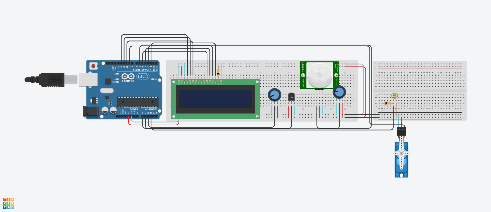

<h1 align="center">LeafCheck - GS_EDGE</h1>
 
  
## :link: Links
* Tinkercad: https://www.tinkercad.com/things/dQaCf0nBt1P-gsedge/editel?sharecode=nMVkLh-caj5z318ILQlZay0pIa0TP9JnWb0rT-MRWSw
   
* Youtbe: https://youtu.be/rLMBpv8rYBw 

## :memo: Descrição do projeto

* O LeafCheck, oferece uma solução inovadora para os agricultores, detecção e prevenção de doenças de plantas por meio de modelos de IA e aprendizado de máquina, com diagnósticos precisos, orientações de tratamento personalizadas e integração de informações climáticas e geográficas, os agricultores podem agir de forma proativa, detectando precocemente doenças e tomando medidas corretivas adequadas.
   
* Pensando nisso, adequamos nossa ideia para o Arduino. Tentamos reproduzir o que nosso aplicativo fará, no LeafCheck serão utilizadas fotos das plantas para que a Inteligência Artificial analíse e diga ao usuário qual é o estado de saúde de sua planta.
Para ilustrar essa funcionalidade, utilizamos diversos sensores para detectar umidade, temperatura, PH do solo, presença de ervas daninhas e a luminosidade, abrindo e fechando a estufa para o bem estar das plantas. Todas as leituras dos sensores são informadas no display a cada 2 segundos.

## :books: Funcionalidades

* <b>Sensor de umidade</b>: Detecta a umidade do solo
   
* <b>Sensor de temperatura</b>: Detecta temperatura ambiente
   
* <b>Sensor de movimento</b>: Detecta se há ervas daninha no solo
   
* <b>Sensor de PH do solo</b>: Detecta se o nivel de PH do solo está aceitavel
   
* <b>Sensor de luminosidade</b>: Alem de detectar a luminosidade, faz com que o motor abra e feche de acordo com a luminosidade do local, se etiver muito alto ele ativa o motor, se estiver baixa ele é desativado.
   
* <b>Display LCD</b>: Informa os resultados dos sensores de forma prética e direta

## :seedling: Instruções de uso

* Clonar repositório
   
* Colocar o código na IDE Arduino
   
* Fazer as devidas conexões dos sensores, fios e resistores no Arduino Uno R3
   
* Rodar o programa

## :clipboard: Requisitos

* 1 Arduino Uno R3
   
* IDE Arduino
   
* 2 Potenciômetros
   
* 1 Sensor de temperatura
   
* 1 Sensor PIR
   
* 1 Fotorresistor
   
* 1 Micro servo
   
* 1 Display LCD 16x2
   
* 2 Resistores de 10KΩ
   
* Ligação ao computador

## :hammer: Dependências
* Biblioteca Servo para funcionamento do Servo Motor
   
* Biblioteca LiquidCrystal para funcionamento do Display LCD

## :wrench: Tecnologias utilizadas

* Arduino;
   
* C++;
   
* Display lcd;
   
* Potenciometro;
   
* Sensor de temperatura;
   
* Sensor PIR;
   
* Fotorresistor;
   
* Micro servo;

## :handshake: Colaboradores
<table>
  <tr>
    <td align="center">
        
          <b>Enzo Luiz Goulart - RM99666</b>
           
        
        
          <b>Natan Eguchi dos Santos - RM98720</b>
           
        
        
          <b>Kayky Paschoal Ribeiro - RM99929</b>
           
        
        
          <b>Gustavo Henrique Santos Bonfim - RM98864</b>
           
        
        
          <b>Lucas Yuji Farias Umada - RM99757 </b>
           
        
    </td>
  </tr>
</table>

## :dart: Status do projeto
Concluido :white_check_mark: